# Secret Agents #

In this project you will learn how to make an uncrackable code to send short messages between two secret agents! You will learn:

- how to make a code known as a **one-time-pad**, 
- how to **encode** a short message so that it looks like gibberish, 
- how to turn the encoded message into **Morse code**, and 
- how to **decode** the message at the other end.

If you don't have the one-time pad, you cannot decode the message but **both** the sender and receiver must have it.

The one-time pad (OTP) tells you by how much to change each *letter* of your message and, as the name implies, is only used **once** then destroyed so that every message uses a **different OTP**.  

For example, let us suppose I have this OTP:

    10, 4, 2, 12, 0

This says that the first letter of the message should be moved 10 characters forward in the alphabet, the second letter 4 characters, and so on. The way this code works is to treat the alphabet as if it was in a circle:

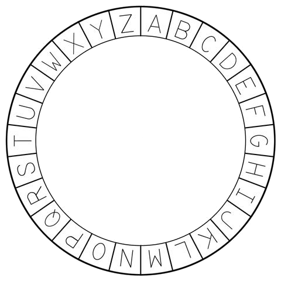

Suppose the message I want to send is "help":

1. h + 10 = **R**
1. e + 4 = **I**
1. l + 2 = **N**
1. p + 12 = **B**

Therefore, **help** is encoded as **RINB** and this is what you send. To decode, the receiving person does the same thing in reverse by **subtracting** the OTP code from the letters in the coded message instead of adding.

1. R - 10 = **H**
1. I - 4 = **E**
1. N - 2 = **L**
1. B - 12 = **P**

Make sure you understand the principle of this as it will be hard to **debug** your code if you don't understand what it is trying to do!

## Prepare Stage ##

1. Delete the cat sprite, and choose two sprites to be the two secret agents. I have chosen __Abby__ as the sender and __Dee__ as the receiver, but you can choose whoever, or whatever, you prefer.

1. Choose an appropriate background, I have used __woods__ but you can choose anything you prefer.

1. Move the two agents so that they are either side of the stage – sender on the left and receiver on the right. Here is my stage so far. Abby is on the left and will encode and send the message, and Dee is on the right who will receive and decode it.

	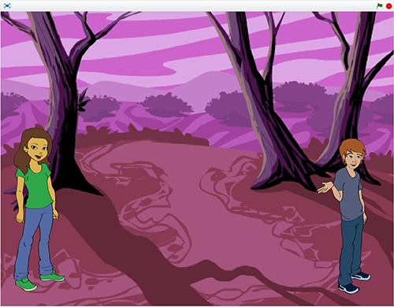

1. Save your project as **secret agents**.

## Create the One Time Pad (OTP) using Random Numbers ##

The One Time Pad, which I will refer to as **OTP** from now on, is the code as I explained above. It is needed by *both* the sender and receiver, but without it the code is impossible to crack.

1. Go to the scripts of your **sender** (Abby in my case). All the code for encoding and sending the message will be put in here.

1. In the 'Data blocks' section, click the _Make a List_ button, set the name to **otp** then click OK - ensure "For all sprites" is selected (as Dee will also need to use it later on). This list will contain the **one-time-pad** which will define the code. In this project, you can save all the variables and lists as “for all sprites”.

1. Move the *otp* list to the centre of the stage, and make it fit the height available and as narrow as you can make it. 

	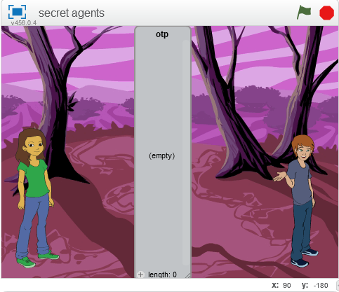

1. Select the **More Blocks** section then click **Make a Block** and you will see the new block panel. Where the cursor is blinking type **generate_otp** then click **OK**.

	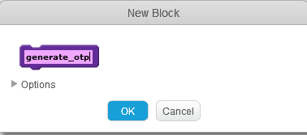

1. This will create a new block called **generate\_otp** and a **define generate\_otp** block in the script section which allows us to make a script for *generate_otp*, then call it with the generate\_otp block whenever we like. You will see why this is a good idea later on.

	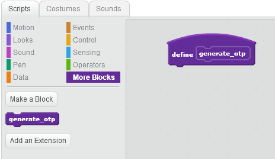

1. Now we can easily write the script to load the **otp** list with 10 random numbers between 0 and 25. This means that the messages will be limited to a **maximum of 10 characters only**, each character can be encoded as any character in the alphabet - including itself (it doesn’t matter if they are **lowercase** or **UPPERCASE**) and that punctuation, numbers and spaces are **not** allowed. To send a number you have to spell it out, e.g. **TWO**.

	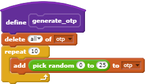
	
1. To test that the OTP is generated correctly, we need to write the first part of the **main program** which will call the **generate_otp** code.

	

1. Now click the green flag and check that the OTP is filled with 10 random numbers as expected. Click it again several times, and each time the 10 numbers will be different which is what makes this code impossible to crack.

	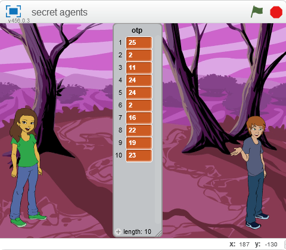

1. Save your project.

## Get the Message You Want to Send (the "plaintext") ##

1. Create a new block called **get\_plaintext** (as you did for generate\_otp).

1. Create a new variable called **plaintext**, which will be used to hold the message you want to send.

1. Add this code which asks for a message and puts the answer into the variable **plaintext** that you just created.

	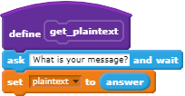

1. Change the main program to call this as well:

	

1. Save your project.

1. Click the green flag to start the program. The OTP will be made as before then you will be asked what message you want to send. Type a short message then press *ENTER*.

## Check that the Message is Valid ##

A snag with the **get\_plaintext** code is that it does not check that the message you have typed is valid. It needs to have a maximum length of 10 characters (as this is the size of the OTP) and must be all letters.

### Change 1: Say That Only Letters Are Allowed ###

The simplest thing we can do is to change the question being asked - remind the user only to use only letters. For example, **What is your message? (Use only letters)**.

### Change 2: Check the Length of The Message ###

This is also quite easy as we can use the *length* of the *answer* variable to check this. If the length is greater than 10, then we give an error message and stop the project.

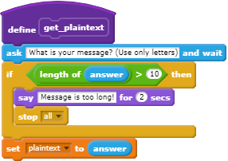

1. Save your project.

### Change 3: Check That Only Letters Have Been Used ###

This is more complicated as we have to find a way of quickly checking that each character of the message is a letter in the alphabet.

1. Make a new list called **alphabet** (for all sprites). 

1. **On the stage**, right-click the new alphabet list and select **import**.

	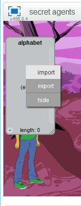

1. Choose **alphabet.txt** from the resources folder, and this will load the list with the alphabet. 

1. If you look at the list, you will see that each letter of the alphabet has a number next to it - for example **A = 1**, **Z = 26**, and **E = 5**.  You will need to use the scroll bar to see the entire list.

	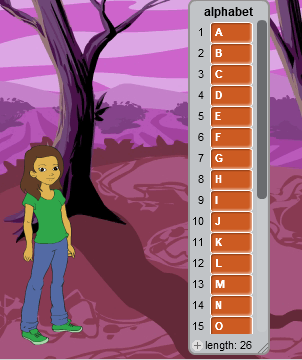

1. Once you are happy that the list has been loaded correctly, 
2.  it before continuing (go to the *data blocks* and remove the tick next to *alphabet*).

1. Save your project.

1. Create a new variable **answer\_ix**, which will be used to point at each character in your answer. "ix" is short for "index" which means a number where something is.

1. Hide *answer\_ix*. From now on, hide all variables and lists when you create them.

1. First check that we can get each character in the message by modifying the **get\_plaintext** code to show each character for 1 second using a *letter of* block.

	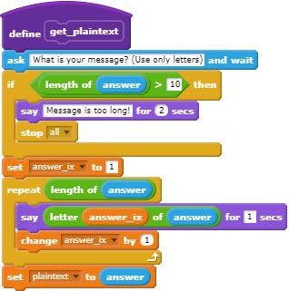

1. Run the program and check that you can see each letter of your message.

1. Now we can finish off the get\_plaintext code so that it checks if each letter can be found in our list *alphabet* using a *contains* block. If not, then we give an error message and stop the project.

	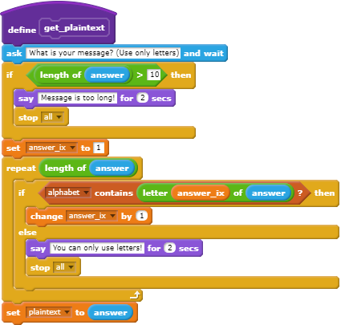

1. Run the program again, now check that:
    
    - a valid message is accepted, 
    - one which is too long is rejected, and 
    - one that contains anything except a letter is also rejected.

1. Save your project.

We now have a robust version of **get\_plaintext** which makes sure that only a valid message is used in our program. This means we don't have to check for this again anywhere else.

## Find the Number of a Letter ##

You can probably make sense of what I mean by *G + 3 = J* because you know what the alphabet is, but a computer doesn't! So the purpose of this step is to have a way of turning a letter like *G* into a number (7 in this case). We will need to do this many times but the *alphabet* list we have already created will help with this.

This function will be needed by **both** secret agents, so we cannot use a *custom block* as it cannot be shared by other sprites. Therefore we will use a *broadcast* block instead.

1. Create the new variables:
    - **character** to hold a single letter from the message and
    - **letter\_index** to hold its position in the alphabet.

1. Add this code. You will need to define the new message **get\_index** when you add the *when I receive* block. The *repeat* block will stop as soon as the current letter of the alphabet is the same as the character being checked - the variable letter\_ix will give its number in the alphabet.

	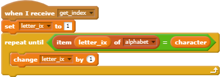

1. Save your project.

## Encrypt the Message ##

Now we can write the code needed to convert our message into apparent gibberish using the OTP code.

1. Create the new variables:

    - **ciphertext** which will hold the complete coded message, 
    - **encrypted** which will contain the code for a single message, and
    - **plain_ix** which will point to a letter in the plaintext. 
 
1. Make a new block **encrypt**.

### Check the get_index Code is Working Correctly ###

1. First we will write just enough to make sure our *get_index* code works correctly. Beware that you need to set *ciphertext* to blank and **not** a space. This extracts each character in the message, turns it into a number of the alphabet, then tells you the character and number.

	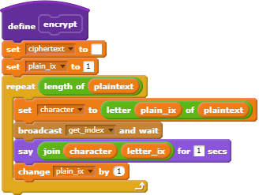

1. Add the **encrypt* block to the main program.

    

1. Test the program with the message **help** and you should see **h8**, **e5**, **l12**, **p16**.

### Add the Encryption Code ###

Now we can put in the code to encrypt the message as I described at the start of this project. If I take our earlier example P + 12 = 16 + 12 = 28, there is no such letter. However, the alphabet can be treated as a circle easily if we use **modulo 26** arithmetic, but this needs to have the letters of the alphabet numbered 0 to 25 as shown below - not 1 to 26 as used in a Scratch list.

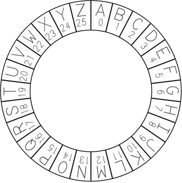

Our code needs to do the following:

- The current number in the OTP is added to the number of the current letter.
- Change this by -1 so that it is in the range 0-25 (rather an 1-26).
- Do the MOD 26 calculation on this number to give the **remainder** after dividing by 26.
- Change this by +1 so that it is in the range 1-26 used by Scratch.
- Convert the number into a letter and add this to the end of the decoded message.
- Repeat for each letter of the plaintext.

Here is a simple example which encodes the letter **P** as **B** when the OTP says **12**.

- P is letter number **16** in our alphabet list (not the circle above)
- 16 + 12 = **28** (12 from the OTP)
- 28 - 1 = **27**
- 27 MOD 26 = **1** (remainder after dividing by 26)
- 1 + 1 = **2**
- 2 is the letter **B** in our alphabet list (not the circle above)

Now you can finish off the encrypt code...

1. Add this code to the *encrypt* block. Note the change of the variable *encrypted* by **-1** and **+1** so that the *mod* block will work.

	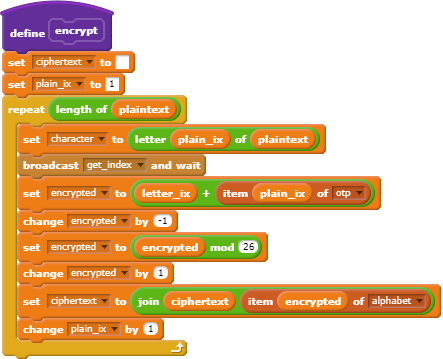

1. Change the starting code to tell you what the ciphertext is when the encryption is complete.

	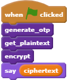

1. Save your project.

1. Test your code so far by clicking the green flag. Type a short message and check that believable gibberish of the same length comes out.

1. Now type **abc** as the message, and make a note of the code which comes out.

1. Using the alphabet circle above, start at the letter **A** and move as many positions clockwise as the first number in the OTP says. 

1. If this matches the first letter of the coded message according to your program, repeat for the letters **B** and **C** using the second and third numbers in the OTP and make sure that the three letters you have worked out are the same as the computer has.

1. Save your project.

## Decrypt the Message ##

1. Change to the scripts of the second sprite (Dee in my case).

1. Define these new variables:

	- **cypher\_ix** which will point to the current letter of the ciphertext,
	- **decoded** which will contain the decoded message, and
	- **decrypted** which will hold the number of the current character.

1. Define a new block **decrypt**.

1. Add this code (to the second sprite). Beware to set *decoded* to blank **not** space. This is very similar to the *encrypt* block, except it does things the other way around - the number in the OTP is subtracted from the current letter number.

	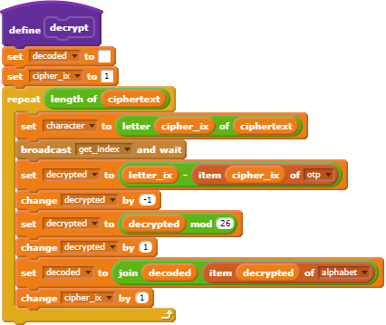

1. Add this simple code to start the decrypt - you will need to create the new message **complete** when you add the *when I receive* block.

	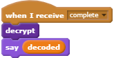

1. Go back to the first sprite (Abby in my case) and modify the starting code by adding the broadcast to tell the second agent (Dee) to decode it,

	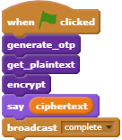

1. Save your project.

1. Run your project, type in a short message such as **hello** and check that your second sprite (Dee in my case) has decoded it correctly. **It will happen very quickly**!

	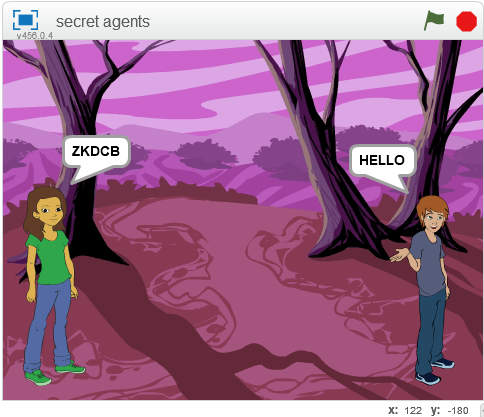

	**Note** Your *coded* message will **not** be the same as mine because you will be using a different OTP code.

## Challenge: Making Sense of Decoded Messages ##

Imagine you are a secret agent and have received this message:

    ENGLANDEXPECTSTHATEVERYMANWILLDOHISDUTY

- What are the **words** in this message - remember spaces and punctuation are not allowed?

- This is a famous message sent in 1805. Do you know where and/or by whom?

## Transmitting the Message ##

At the moment, the message has magically arrived at the second agent (Dee in my case) and been decoded. But how did it get there? Most likely it was sent by radio, which is why it had to be sent in code so that if anyone else picked it up then all they would have is gibberish.

The image below shows the __Morse Code__, which was invented by Samuel Morse in 1832 which defined a pattern of beeps which could be understood at both ends of the line by skilled people. It includes both letters and numbers, but our __otp__ code will only be using the 26 letters of the alphabet.

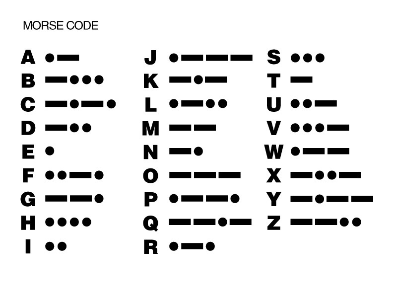

The Morse Code is not secret, like our One Time Pad code, but used internationally to turn letters into a series of dots and dashes. A dot is a short "dit" and a dash a longer "dah". The encoded message can be sent using Morse Code because even if someone else picks it up it doesn't make sense. For example, in my simple case above they would receive **ZKDCB** rather than *HELLO*. 

Warships still use Morse Code today to transmit messages using a bright light over short distances. Radio amateurs also use it to communicate over very long distances with each other - even when very faint and crackly the Morse code beeps can still be picked out. The distress call made from the sinking __RMS Titanic__ in 1912 was sent by radio using Morse Code.

So we will add a step to our project so that once we have encoded the message ready for sending, we will switch on our radio transmitter and send it in Morse code to the second agent.

1. Go back to the scripts of the first agent (Abby in my case).
 
1. Create a new list **morse** which will hold the symbols for each Morse code letter (A to Z).

1. **On the stage**, right-click the new morse list and select **import**. Choose **morse.txt** from the resources folder, and this will load the list with the Morse code. 

1. If you look at the morse list, you will see the symbols needed for each Morse character. When you are satisfied that it has been loaded correctly, hide it.

    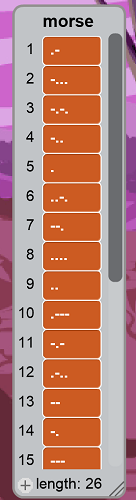

1. Create the additional variables we will need:

	- **code** to hold the Morse code for the current letter.
	- **morse_ix** to keep track of where we are in the Morse code for a particular letter.

1. Create a new block **transmit**.

1. Write the following code. Each letter in the enciphered message is converted into its Morse code equivalent. As this can have more than one symbol (dots and dashes), we also need to check each of these symbols then make the necessary short (dot) or long (dash) sound.

	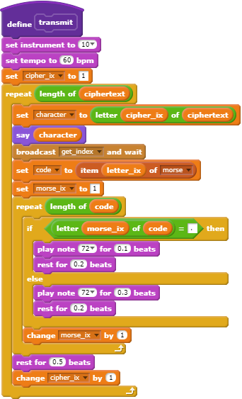

1. Modify the starting code so that it includes calling *transmit*.

	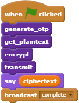

1. Save your project.

1. Test your improved project and check that the first agent (Abby in my case) says each coded letter which is then transmitted in Morse code. When complete, the complete coded message will be shown as before, and the second agent (Dee in my case) will hopefully show the original plain text message.

**Note:** You may want to increase the *rest for 0.5 beats* block to have a longer space between letters to give you time to check that the code is being transmitted correctly.   

## Send Morse via Raspberry Pi GPIO ##

If you are running this project on a Raspberry Pi, you can easily modify the project so that instead of using an instrument in Scratch to play the Morse code, you control a GPIO pin on the Raspberry Pi to flash a LED or sound a buzzer.

1. Assemble an appropriate electronic circuit on the Raspberry Pi which is controlled by a GPIO pin of your choice.

1. Make sure that the **PI GPIO** extension has been loaded using **Add an Extension** in **More Blocks**.

1. This will make two additional blocks available to you.

	- To *set* a GPIO pin to **output high** (on), **output low** (off), or being used for **input** to the Raspberry Pi.
	- To *test* if a GPIO pin is currently high (on).

	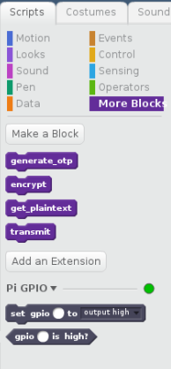

1. Create a new variable **gpio** to hold the GPIO pin you wish to use. This will make it very easy to use a different pin, for instance to change between a LED or a buzzer.

1. Modify the starting program to initialise the GPIO variable with the port number and make sure it starts as off. I have used port 17 because I have a LED on pin 17 and a buzzer on pin 18.

	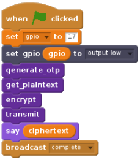

1. Modify the *transmit* block to the following. I have kept the music blocks for timing to keep the changes simple but these could be replaced by *waits* of the same fractions of a second.

	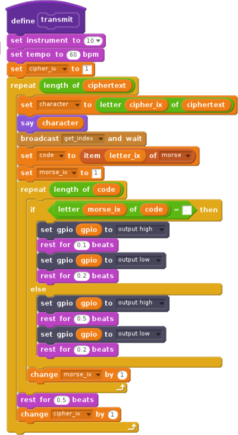

1. Save your project as **secret agents gpio** so that the original project is still there as well.

1. Test the project and check that the appropriate actions on the GPIO port takes place - the LED flashes or the buzzer sounds - and that the Morse code can still be understood.
